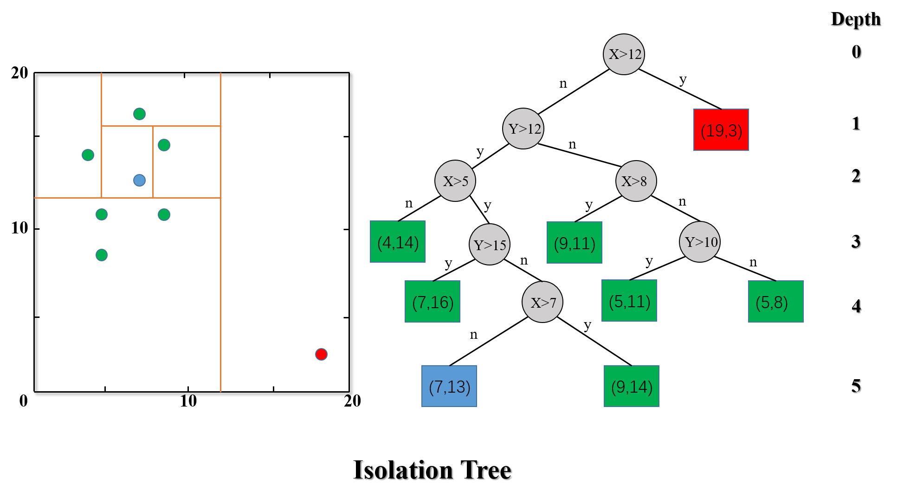
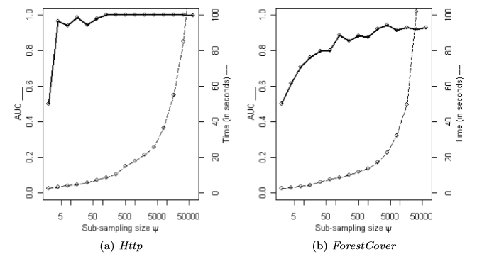
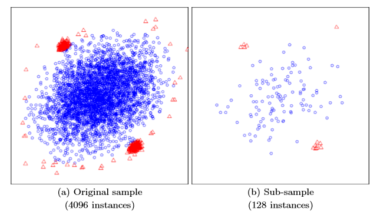
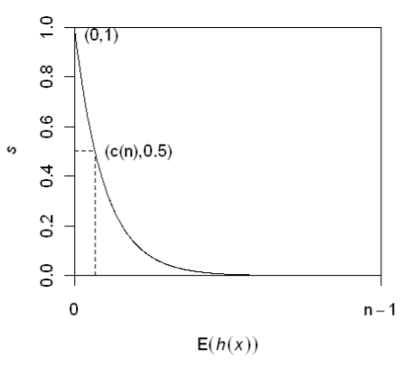

# 
Isolation Forest算法梳理

<strong>杨航锋</strong>

异常是一个观测值，其偏离其他观测值太多以至于可以合理地推测该观测来自于其他机制，孤立森林$\ (Isolation\ Forest)\ $是一个基于$\ Ensemble\ $的快速异常检测方法，具有线性时间复杂度和高精准度。其可以用于网络安全中的攻击检测，金融交易欺诈检测，疾病侦测，和噪声数据过滤等。

#### 1 $\ iTree \ $的构建

> 孤立森林算法的理论基础有两点：
>
> - 异常数据占总样本量的比例很小；
> - 异常点的特征值与正常点的差异很大。

提到森林，自然少不了树，毕竟森林都是由树构成的，理解$\ Isolation\ Forest\ $(简称$\ iForest\ $)前，首先需要了解$\ Isolation\ Tree\ $(简称$\ iTree\ $)是怎么构成的，$\ iTree\ $是一棵随机二叉树，每一个节点要么有两个孩子，要么就是叶子节点。假设给定一堆数据集$\ \mathbb{D} \ $，这里$\ \mathbb{D} \ $的所有属性都是连续型的变量，$\ iTree\ $的构建过程如下：

1. 随机选择一个属性$\ Attr\ $；
2. 随机选择该属性的一个值$\ Value\ $，$\ \min\{Attr\}<Value<\max\{Attr\} \ $;
3. 根据$ \ Attr\ $对每条记录进行分类，把$\ Attr\ $小于$\ Value\ $的记录放在左子树，把大于等于$\ Value\ $的记录放在右子树；
4. 递归构造左右子树，直到满足下列条件：
    - 传入的数据集只有一条记录或者多条同样的记录；
    - 树的深度达到了限定深度。

$\ iTree \ $构建完成之后，只需要追踪测试数据落在$\ iTre e \ $哪个叶子节点上即可评估该数据是否为异常数据，由图中$\ i Tree \ $的构造过程可以发现异常数据通常会很快被分配到叶子节点上，因此可以使用叶子结点到根结点的路径长度（即边的条数）$\ h(x)\ $来判断一条记录$\ x\ $是否是异常点。

#### 2 $\ iForest \ $的构建

由于$\ iTree\ $是随机选择属性和随机选择属性值来构建的，因此可以预见对于单棵$\ iTree\ $的预测效果肯定不会很理想，因此通过引入多棵$\ iTree\ $共同来预测那么从效果上看肯定会更具有说服力。$\ iForest\ $和$\ Random\ Forest\ $的方法有些类似，都是通过随机采样，利用部分采样数据来构造每一棵树，以保证不同树之间的差异性。在构建$\ iForest\ $的过程中有，采样的样本大小$\  \psi \ $和$\ iTree\ $的数量$ \ t \ $这两个超参数需要确定，样本采样大小超过$\ 256\ $效果就提升不大了。

通过采样数据不仅可以降低计算时间的上面的浪费，而且还能够解决一些其它的小问题

左图是原始数据，右图是经过采样了的数据，蓝色代表正常样本，红色代表异常样本。可以看出，在采样之前，正常样本和异常样本出现了重叠，因此很难分开，但通过采样之后，异常样本和正常样本可以明显的分开。$\ t\ $控制了$\ iTree\ $的数量即$\ Ensemble\ size \ $，孤立森林算法提出者通过实验发现，当$\ t=100\ $之前时，算法就会收敛，故通常设置$\ t\ $为默认值$\ 100\ $，训练一个$\ iForest\ $最差情况下的时间复杂度为$\ \mathcal{O}(t\psi^2) \ $空间复杂度为$\ \mathcal O(t\psi) \ $。

#### 3 评估

为了更好的归一化和比较，孤立森林通过引入异常值函数$\ s(x, n)\ $来衡量记录$\ x\ $是否为异常点。

> 给定一个包含$\ n\ $个样本的数据集，树的平均路径长度为：
> $$
> c(n)=2H(n-1)-\frac{2(n-1)}{n}
> $$
> 其中，$\ H(*)\ $为调和数，$\ H(*)=\ln(*)+\xi \ $，$\ \xi \ $为欧拉常数，约为$\ 0.5772156649\ $ 。$\ c(n)\ $为给定样本数$\ n\ $时，路径长度的平均值，用来标准化记录$\ x\ $的路径长度$\ h(x)\ $。

故记录$\ x\ $的异常得分可以定义为：
$$
s(x, n)=2^{-\frac{E(h(x))}{c(n)}}
$$
其中，$\ E(h(x))\ $为记录$\ x\ $在多个$\ iTree\ $中的路径长度的期望值。可视化$\ s(x,n)\ $与$\ E(h(x))\ $的关系

可以得出以下结论：

- 当$\ E(h(x))\rightarrow c(n) \ $时，$\ s\rightarrow 0.5 \ $，即记录$\ x\ $的平均长度与树的平均路径长度相近时，则不能区分是否为异常；
- 当$\ E(h(x))\rightarrow 0 \ $，$\ s\rightarrow 1 \ $，即记录$\ x\ $的异常分数接近$\ 1\ $时，被判定为异常数据；
- 当$\ E(h(x))\rightarrow n-1 \ $时，$\ s\rightarrow 0 \ $，被判定为正常数据。

