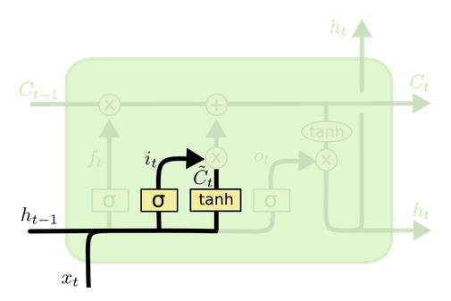
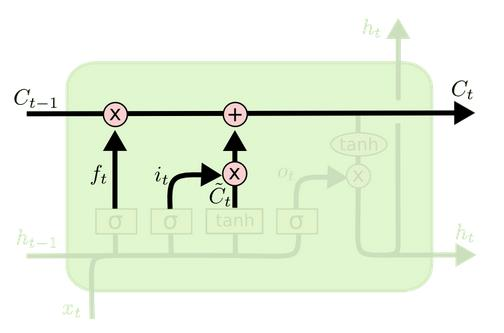
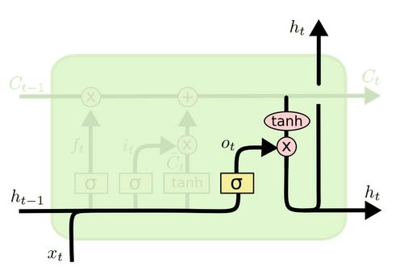
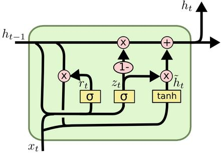

# 
$LSTM$和$GRU$算法简单梳理

<strong>杨航锋</strong>

#### 1  $\boldsymbol{LSTM}\ $框架结构

$\ h_{t}\ $：当前序列的隐藏状态、$\ x_{t}\ $：当前序列的输入数据、$\ C_{t}\ $：当前序列的细胞状态、$\ \sigma\ $：$\ sigmoid\ $激活函数、$\ \tanh \ $：$\ \tanh \ $激活函数。

#### 2  $\boldsymbol{LSTM}\ $之遗忘门

遗忘门是控制是否遗忘的，在$\ LSTM\ $中即以一定的概率控制是否遗忘上一层的细胞状态。图中输入的有前一序列的隐藏状态$\ h_{t-1}\ $和当前序列的输入数据$\ x_t\ $，通过一个$\ sigmoid \ $激活函数得到遗忘门的输出$\ f_t \ $。因为$\ sigmoid\ $函数的取值在$\ [0, 1]\ $之间，所以$\ f_t \ $表示的是遗忘前一序列细胞状态的概率，数学表达式为
$$
\begin{equation}

f_{t}=\sigma\left(W_{f} \cdot\left[h_{t-1}, x_{t}\right]+b_{f}\right)

\end{equation}
$$

#### 3  $\boldsymbol{LSTM}\ $之输入门

输入门是用来决定哪些数据是需要更新的，由$\ sigmoid\ $层决定；然后，一个$\ \tanh\ $层为新的候选值创建一个向量$\ \tilde{C_t}\ $ ，这些值能够加入到当前细胞状态中，数学表达式为
$$
\begin{equation}
\begin{aligned} i_{t} &=\sigma\left(W_{i} \cdot\left[h_{t-1}, x_{t}\right]+b_{i}\right) \\ \tilde{C}_{t} &=\tanh \left(W_{C} \cdot\left[h_{t-1}, x_{t}\right]+b_{C}\right) \end{aligned}
\end{equation}
$$

#### 4  $\boldsymbol{LSTM}\ $之细胞状态更新

前面的遗忘门和输入门的结果都会作用于细胞状态$\ C_t \ $，在决定需要遗忘和需要加入的记忆之后，就可以更新前一序列的细胞状态$\ C_{t-1}\ $到当前细胞状态$\ C_t\ $了，前一序列的细胞状态$\ C_{t-1}\ $乘以遗忘门的输出$\ f_t\ $表示决定遗忘的信息，$\ i_t\odot \tilde{C_t}\ $表示新的记忆信息，数学表达式为
$$
C_{t}=C_{t-1}\odot f_t+i_t\odot \tilde{C_t}
$$

#### 5  $\boldsymbol{LSTM}\ $之输出门

在得到当前序列的细胞状态$\ C_t\ $后，就可以计算当前序列的输出隐藏状态$\ h_t\ $了，隐藏状态$\ h_t\ $的更新由两部分组成，第一部分是$\ o_t\ $，它由前一序列的隐藏状态$\ h_{t-1}\ $和当前序列的输入数据$\ x_t \ $通过激活函数$\ sigmoid\ $得到，第二部分由当前序列的细胞状态$\ C_t  \ $经过$\ \tanh\ $激活函数后的结果组成，数学表达式为
$$
\begin{equation}
\begin{aligned} 
o_t&=\sigma{(W_o\cdot[h_{t-1},x_t]+b_o)}\\
h_t&=o_t\odot \tanh{(C_t)}
\end{aligned}
\end{equation}
$$

#### 6  $\boldsymbol{GRU}\ $框架结构及原理

循环门单元($Gated\ Recurrent\ Unit,\ GRU$)，它组合了遗忘门和输入门到一个单独的更新门当中，也合并了细胞状态$\ C\ $和隐藏状态$\ h\ $，并且还做了一些其他的改变，使得其模型比标准$\ LSTM\ $模型更简单，其数学表达式为
$$
\begin{equation}
\begin{aligned} z_{t} &=\sigma\left(W_{z} \cdot\left[h_{t-1}, x_{t}\right]\right) \\ r_{t} &=\sigma\left(W_{r} \cdot\left[h_{t-1}, x_{t}\right]\right) \\ \tilde{h}_{t} &=\tanh \left(W \cdot\left[r_{t} \odot h_{t-1}, x_{t}\right]\right) \\ h_{t} &=\left(1-z_{t}\right) \odot h_{t-1}+z_{t} \odot \tilde{h}_{t} \end{aligned}
\end{equation}
$$
首先介绍$\ GRU\ $的两个门，它们分别是重置门$\ r_t\ $和更新门$\ z_t\ $，计算方法与$\ LSTM\ $中门的计算方法是一致的；然后是计算候选隐藏层$\ \tilde{h}_t\ $，该候选隐藏层和$\ LSTM\ $中的$\ \tilde{C}_t\ $类似，都可以看成是当前时刻的新信息，其中$\ r_t\ $用来控制需要保留多少之前的记忆，如果$\ r_t\ $为$\ 0\ $则表示$\ \tilde{h}_t\ $只保留当前序列的输入信息；最后$\ z_t\ $控制需要从前一序列的隐藏层$\ h_{t-1}\ $中遗忘多少信息和需要加入多少当前序列的隐藏层信息$\ \tilde{h}_t \ $，从而得到当前序列的输出隐藏层信息$\ h_t\ $，而$\ GRU\ $是没有输出门的。

#### 参考资料

[Understanding LSTM Networks](http://colah.github.io/posts/2015-08-Understanding-LSTMs/)

