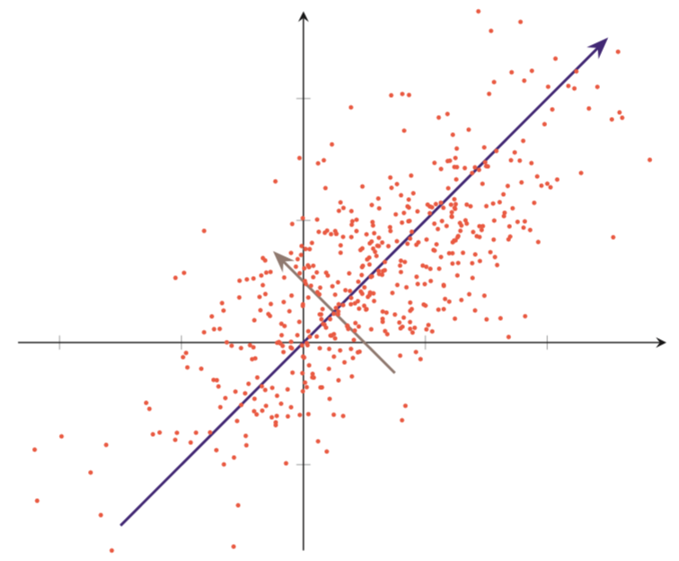

## 
PCA算法

<strong>杨航锋</strong>

​	**主成分分析** (**PCA)** 是一种分析、简化数据集的技术，主成分分析经常用于降低数据集的维数，同时保持数据集中的对方差贡献最大的特征，然后它是一种有损压缩算法。[更多文章见GitHub地址](https://github.com/yhangf/ML-NOTE)

​	$\ PCA \ $ 问题的优化目标：将一组$\ n \ $维向量降为$\ k \ $维$\ (0\lt k\le n) \ $，其目标是选择$\ k \ $个单位正交基，使得原始数据变换到该组基上后，各特征两两之间的协方差为$\ 0 \ $，而特征的方差则尽可能大，当在正交的约束下取最大的$\ k \ $个方差。

​	假设我们有$\ m\ $个$\ n\ $维数据记录，将其按列排成$\ n\times m\ $的矩阵$\ X\ $，令$\ C=\dfrac{1}{m}XX^T\ $，则$\ C\ $是一个半正定对称矩阵$\ (\xi C\xi^T\ge 0)\ $，其对角线分别为各个特征的方差，而$\ C_{i,j}=C_{j,i}\ $，分别表示$\ i、j\ $两个特征的协方差。 $\ P\ $是一组基按行组成的矩阵 ，$\ Y\ $为$\ P\ $对$\ X\ $做基变换后的数据即降维后的数据，有$\ Y=PX\ $。
$$
\begin{aligned}
D&=\dfrac{1}{m}YY^T\\
&=\dfrac{1}{m}(PX)(PX)^T\\
&=P(\dfrac{1}{m}XX^T)P^T\\
&=PCP^T
\end{aligned}
$$
因此原优化目标转化成寻找一个矩阵$\ P\ $，满足$\ PCP^T\ $是一个对角矩阵，并且对角元素按从大到小依次排列，那么$\ P\ $的前$\ k\ $行就是要寻找的基，用$\ P\ $的前$\ k\ $行组成的矩阵乘以$\ X\ $就使得$\ X\ $从$\ n\ $维降到了$\ k\ $维并满足原始优化条件，又因为$\ C\ $是实对称矩阵故可相似对角化。

#### 极大投影方差法

极大投影方差法的思想是使得在投影后的空间中数据的方差最大，选择数据方差最大的方向进行投影，才能最大化数据的差异性，因此可以保留更多的原始数据信息。假设输入空间 $\cal X \in \R^n \ $ 为$\ n\ $维向量的集合，特征向量 $\ x^{(i)} \in  \cal X\ $，投影向量为$\  u \in \mathbb{R}^d\ $且限制$\ u\ $的模长为$\ 1\ $即$\ u^Tu=1\ $，对原始特征向量$\ x^{(i)}\ $进行去中心化处理，使得去中心化后的特征向量$\ z^{(i)}\ $各特征分量的均值为$\ 0\ $。

> 令$\ \overline{x}=(\overline{x_1}, \overline{x_2}, \cdots,\overline{x_n})\ $，$\ \overline{x_i} \ $为第$\ i\ $个特征的均值，故有
> $$
> \begin{aligned}
> 0_n^T&=\frac{1}{m}\sum\limits_{i=1}^mz^{(i)}\\
> &=\frac{1}{m}\sum\limits_{i=1}^m(x^{(i)}-\overline{x})\\
> &=\frac{1}{m}\sum\limits_{i=1}^m x^{(i)}-\frac{1}{m}\cdot m\cdot\overline{x}\\
> &=\overline{x}-\overline{x}
> \end{aligned}
> $$
> 为什么限制$\ u\ $的模长为$\ 1\ $?
> $$
> (z^{(i)})^Tu=\vert (z^{(i)})^T \vert\cdot\vert u\vert\cdot \cos\theta
> $$
> 这样特征向量$\ z^{(i)}\ $在$\ u\ $上的投影可以表示为内积的形式。

样本投影后的方差为
$$
\begin{aligned}
\sigma(X,u)&=\frac{1}{m}\sum\limits_{i=1}^m[(z^{(i)})^T u-0]^2\\
&=\frac{1}{m}\sum\limits_{i=1}^m[(z^{(i)})^T u]^T[(z^{(i)})^T u]\\
&=\frac{1}{m}\sum\limits_{i=1}^m u^Tz^{(i)}(z^{(i)})^Tu\\
&=u^T{\color{red}{S}}u
\end{aligned}
$$
因此优化函数为
$$
\begin{aligned}
&\mathop{\arg\max}_{u}\ u^TSu\\
&s.t.\ \ \ u^Tu=1\\
\
\end{aligned}
$$
通过拉格朗日方法转换为无约束问题，其中$\ \lambda\ $为拉格朗日乘子
$$
\mathop{\arg\max}_{u}\ u^TSu +\lambda(1-u^Tu)
$$
对上式求导可得
$$
Su=\lambda u
$$
从上式可知，$\ u\ $是协方差矩阵$\ S\ $的特征向量，$\ \lambda\ $为特征值。同时有
$$
\sigma(X,u)=u^TSu=u^T\lambda u=\lambda
$$
$\ \lambda \ $也是投影后样本的方差。因此，主成分分析可以转换成一个矩阵特征值分解问题，投影向量$\ u \ $为矩阵$\ S \ $的最大特征对应的特征向量。

**总结一下$\ PCA\ $的算法步骤：**

假设有$\ m\ $条$\ n\ $维数据：

1. 将原始数据按列组成$\ n\ $行$\ m\ $列矩阵$\ X\ $；
2. 将$\ X\ $的每一行进行零均值化，即减去这一行的均值；
3. 求出协方差矩阵$\ C=\dfrac{1}{m}XX^T\ $；
4. 求出协方差矩阵的特征值及对应的特征向量；
5. 将特征向量按对应特征值大小从上到下按行排列成矩阵，取前$\ k\ $行组成矩阵$\ P\ $；
6. $\ Y=PX\ $即为降维到$\  k\ $维后的数据。