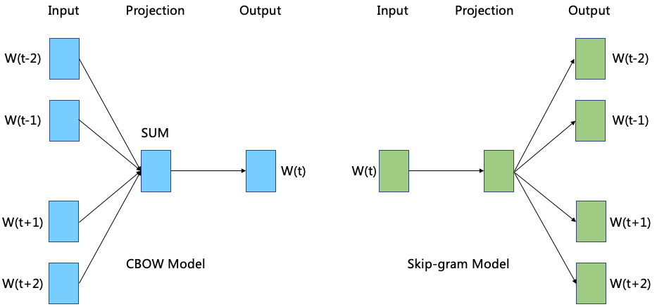
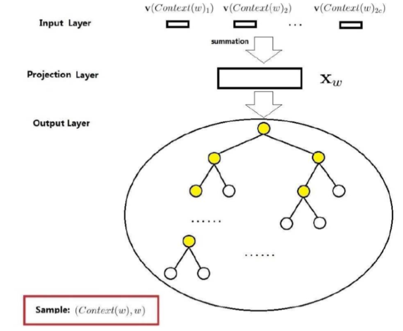
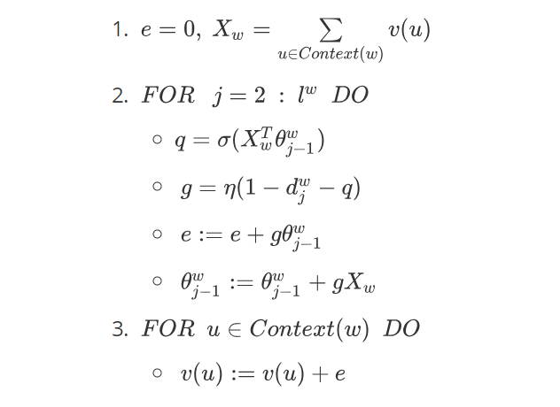
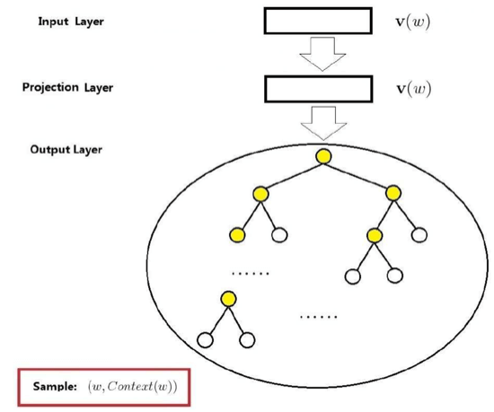

# 
$Word2Vec$算法梳理

<strong>杨航锋</strong>

#### 1  $Word2Vec\ $模型总述

​	$Word2Vec\ $简单讲其实就是通过学习文本然后用词向量的方式表征词的语义信息，即通过$\ Embedding \ $把原先词所在空间映射到一个新的空间中去，使得语义上相似的单词在该空间内距离相近。以传统神经网络为基础的神经概率语言模型，缺点主要是计算量太大，集中体现在：**隐层和输出层之间的矩阵运算**和**输出层上的$\boldsymbol{Softmax}$归一化运算**上。因此 $\ Word2Vec\ $就是针对这两点来优化神经概率语言模型的。$Word2Vec\ $中两个重要的模型是：**$\boldsymbol{CBOW}\ $模型**和**$\ \boldsymbol{Skip\text{-}gram}\ $模型**。对于这两个模型，$Word2Vec\ $给出了两套框架，分别是基于$\ \boldsymbol{Hierarchical\ Softmax}\ $和$\ \boldsymbol{Negative \ Sampling}\ $来设计的，本文梳理的是第一种类型。

#### 2  $\boldsymbol{CBOW}\ $模型

##### 2.1  基于$\ \boldsymbol{Hierarchical\ Softmax}\ $模型的网络结构

​	$\boldsymbol{CBOW}\ ​$模型的全称是$Continous\ bag\text{-}of\text{-}words​$，它包括三层结构分别是：输入层、投影层和输出层。

1. **输入层**：包含$\ Context(w) \ ​$中$\ 2c\ ​$个词的词向量$\  v(Context(w)_1),v(Context(w)_2),\cdots,v(Context(w)_{2c}) \ ​$其中$ \ \forall v \in \mathbb{R}^n \ ​$，$n \ ​$表示词向量的长度。

2. **投影层**：将输入层的$\ 2c\ ​$个向量做求和累加处理，即$\ X_w=\sum\limits_{i=1}^{2c}v(Context(w)_i) \ ​$。

    

3. **输出层**：输出层对应一颗$\ Huffman\ $树，它是以语料中出现过的词当叶子节点，以各词在语料库中出现的次数当权值构造而成。在这颗$\ Huffman \ $树中，叶子结点共$\ N(=\vert\mathcal{D}\vert) \ $个分别对应词典$\ \mathcal{D} \   $中的词，非叶结点$\ N-1\ $个（上图中黄色的结点）。

##### 2.2  梯度的计算

​	为了后续方便描述问题，首先对$\ \boldsymbol{CBOW}\ $模型中用到的符号做一个统一的说明：

- $\ p^w \ $：从根节点到出发到达$\ w\ $对应叶子结点的路径；
- $\ l^w\ $：路径$\ p^w  \ $中包含节点的个数；
- $\ \{p_1^w,p_2^w,\cdots,p_{l^w}^w\}\ ​$：路径$\ p^w \ ​$中的$\ l^w \ ​$个结点，其中$\ p_1^w\ ​$表示根结点，$\  p_{l^w}^w \ ​$表示词$\ w  \ ​$对应的结点；
- $\ \{d_2^w,d_3^w,\cdots,d_{l^w}^w\}\ $，其中$\ d_j^w\in\{0, 1\}\ $：词$\ w\ $对应的$\ Huffman\ $编码，它由$\ l^w-1\ $位编码构成，$\ d_j^w\ $表示路径$\ p^w\ $中第$\ j\ $个结点对应的编码（根结点不对应编码）；
- $\ \{\theta_1^w,\theta_2^w,\cdots,\theta_{l^w{-}1}^w \} \ $，其中$\ \theta_j^w\in \mathbb{R}^n\ $：路径$\ p^w\ $中非叶子结点对应的向量，$\ \theta_j^w\ $表示路径$\ p^w\ $中第$ \ j\ $个非叶子结点对应的向量。

所以$\ \boldsymbol{Hierarchical\ Softmax}\ ​$的思想，**即对于词典$\ \mathcal{D}\ ​$中的任意词$\ w\ ​$，$Huffman\ ​$树中必然存在唯一一条从根结点到词$\ w\ ​$对应叶子结点的路径$\ p^w\ ​$。路径$\ p^w\ ​$上存在$\ l^w-1\ ​$个分支，将每个分支看作一次二分类，那么每一次分类就对应一个概率，最后将这些概率连乘得到$\ p(w|Context(w))\ ​$。**
$$
\begin{aligned}
p(w|Context(w))&=\prod\limits_{j=2}^{l^w}p(d_j^w|X_w;\theta_{j-1}^w)\\
p(d_j^w|X_w;\theta_{j-1}^w)&=
\begin{cases} 
\sigma(X_w^T\theta_{j-1}^w), & if\ \ d_j^w=0\\
1-\sigma(X_w^T\theta_{j-1}^w), &otherwise
\end{cases}\\
&=[\sigma(X_w^T\theta_{j-1}^w)]^{1-d_j^w}\cdot[1-\sigma(X_w^T\theta_{j-1}^w)]^{d_j^w}
\end{aligned}
$$
其中$\ \sigma(x)=\dfrac{1}{1+e^{-x}}\ ​$。通过对数极大似然化处理可得$\ \boldsymbol{CBOW}\ ​$模型的目标函数为：
$$
\begin{aligned}
\mathcal{L}&=\sum\limits_{w\in\mathcal{D}}\log\prod_{j=2}^{l^w}\left([\sigma(X_w^T\theta_{j-1}^w)]^{1-d_j^w}\cdot[1-\sigma(X_w^T\theta_{j-1}^w)]^{d_j^w} \right)\\
&=\sum\limits_{w\in\mathcal{D}}\sum\limits_{j=2}^{l^w}\left((1-d_j^w)\cdot\log[\sigma(X_w^T\theta_{j-1}^w)]+d_j^w\cdot\log[1-\sigma(X_w^T\theta_{j-1}^w)] \right)\\
&=\sum\limits_{w\in\mathcal{D}}\sum\limits_{j=2}^{l^w}\varPhi(\theta_{j-1}^w,X_w)
\end{aligned}
$$
$\ Word2Vec\ ​$极大化化目标函数使用的算法是是**随机梯度上升法**，首先考虑$\ \varPhi(\theta_{j-1}^w,X_w)\ ​$关于$\ \theta_{j-1}^w\ ​$的梯度计算：
$$
\begin{aligned}
\dfrac{\partial\varPhi(\theta_{j-1}^w,X_w)}{\partial \theta_{j-1}^w}&=\dfrac{\partial}{\theta_{j-1}^w}\left((1-d_j^w)\cdot\log[\sigma(X_w^T\theta_{j-1}^w)]+d_j^w\cdot\log[1-\sigma(X_w^T\theta_{j-1}^w)] \right)\\
&=(1-d_j^w)[1-\sigma(X_w^T\theta_{j-1}^w)]X_w-d_j^w\sigma(X_w^T\theta_{j-1}^w)X_w\\
&=\left((1-d_j^w)[1-\sigma(X_w^T\theta_{j-1}^w)]-d_j^w\sigma(X_w^T\theta_{j-1}^w) \right)X_w\\
&=\left(1-d_j^w-\sigma(X_w^T\theta_{j-1}^w)\right)X_w 
\end{aligned}
$$
于是，$\ \theta_{j-1}^w\ ​$的更新公式为：
$$
\theta_{j-1}^w:=\theta_{j-1}^w+\eta\left(1-d_j^w-\sigma(X_w^T\theta_{j-1}^w) \right)X_w
$$
然后再考虑$\ \varPhi(\theta_{j-1}^w,X_w)\ ​$关于$\ X_w\ ​$的梯度计算：
$$
\begin{aligned}
\dfrac{\partial\varPhi(\theta_{j-1}^w,X_w)}{\partial X_w}&=\dfrac{\partial}{X_w}\left((1-d_j^w)\cdot\log[\sigma(X_w^T\theta_{j-1}^w)]+d_j^w\cdot\log[1-\sigma(X_w^T\theta_{j-1}^w)] \right)\\
&=(1-d_j^w)[1-\sigma(X_w^T\theta_{j-1}^w)]\theta_{j-1}^w-d_j^w\sigma(X_w^T\theta_{j-1}^w)\theta_{j-1}^w\\
&=\left((1-d_j^w)[1-\sigma(X_w^T\theta_{j-1}^w)]-d_j^w\sigma(X_w^T\theta_{j-1}^w) \right)\theta_{j-1}^w\\
&=\left(1-d_j^w-\sigma(X_w^T\theta_{j-1}^w)\right)\theta_{j-1}^w
\end{aligned}
$$
如果观察到$\ \varPhi(\theta_{j-1}^w,X_w)\ ​$中$\ \theta_{j-1}^w \ ​$和$\ X_w \ ​$具有对称性，那么计算相应梯度会更方便。由于$\ X_w\ ​$表示的是$\ Context(w)\ ​$中所有词向量的叠加，那么如何根据$\ \nabla_{X_w}\varPhi(\theta_{j-1}^w,X_w) \ ​$来更新每一个分量$\ v(\widetilde{w})\ ​$呢？$\ Word2Vec \ ​$中的做法非常的朴素，直接取
$$
v(\widetilde{w}):=v(\widetilde{w})+\eta\sum\limits_{j=2}^{l^w}\dfrac{\partial\varPhi(\theta_{j-1}^w,X_w)}{\partial X_w},\ \ \widetilde{w}\in Context(w)
$$

##### 2.3  $\ \boldsymbol{CBOW}\ $模型更新相关参数伪代码

#### 3  $\boldsymbol{Skip\text{-}gram}\ $模型

##### 3.1  基于$\ \boldsymbol{Hierarchical\ Softmax}\ $模型的网络结构

​	同$\ \boldsymbol{CBOW}\ ​$模型一样，$\ \boldsymbol{Skip\text{-}gram}\ ​$模型的网络结构也包括三层结构分别是输入层、投影层和输出层：

1. **输入层**：只含有当前样本的中心词$\ w\ ​$的词向量$\ v(w)\in \mathbb{R}\ ​$。

2. **投影层**：该层为恒等投影，其实这层可有可无，在这里只是为了方便和$\ \boldsymbol{CBOW}\ ​$模型的网络结构做对比。

    

3. **输出层**：和$\ \boldsymbol{CBOW}\ ​$模型一样，输出层也是一颗$\ Huffman\ ​$树。

##### 3.2  梯度的计算

​	对于$\ \boldsymbol{Skip\text{-}gram}\ ​$模型已知的是当前词$\ w\ ​$，需要对其上下文$\ Context(w)\ ​$中的词进行预测，所以关键是条件概率函数$\ p(Context(w)|w)\ ​$的构造，$\ \boldsymbol{Skip\text{-}gram}\ ​$模型中将其定义为：
$$
p(Context(w)|w)=\prod\limits_{u\in Context(w)}p(u|w)
$$
上式中的$\ p(u|w)\ $可以类比上节介绍的$\ \boldsymbol{Hierarchical\ Softmax}\ $的思想，因此可得：
$$
\begin{aligned}
p(u|w)&=\prod\limits_{j=2}^{l^w}p(d_j^u|v(w);\theta_{j-1}^u)\\
&=\prod\limits_{j=2}^{l^u}[\sigma(v(w)^T\theta_{j-1}^u) ]^{1-d_j^u}\cdot[1-\sigma(v(w)^T\theta_{j-1}^{u}]^{d_j^u}
\end{aligned}
$$
通过对数极大似然化处理可得$\ \boldsymbol{Skip\text{-}gram}\ $模型的目标函数为：
$$
\begin{aligned}
\mathcal{L}&=\sum\limits_{w\in \mathcal{D}}\log\prod\limits_{u\in Context(w)}\prod_{j=2}^{l^u}\left([\sigma(v(w)^T\theta_{j-1}^u) ]^{1-d_j^u}\cdot[1-\sigma(v(w)^T\theta_{j-1}^{u}]^{d_j^u} \right)\\
&=\sum\limits_{w\in\mathcal{D}}\sum\limits_{u\in Context(w)}\sum\limits_{j=2}^{l^u}\left((1-d_j^u)\cdot\log[\sigma(v(w)^T\theta_{j-1}^u)]+d_j^u\cdot\log[1-\sigma(v(w)^T\theta_{j-1}^u)] \right)\\
&=\sum\limits_{w\in\mathcal{D}}\sum\limits_{u\in Context(w)}\sum\limits_{j=2}^{l^u}\mathcal{O}(\theta_{j-1}^u,v(w))
\end{aligned}
$$
首先考虑$\ \mathcal{O}(\theta_{j-1}^u,v(w))\ ​$关于$\ \theta_{j-1}^u\ ​$的梯度计算：
$$
\begin{aligned}
\dfrac{\partial \mathcal{O}(\theta_{j-1}^u,v(w))}{\partial \theta_{j-1}^u}&=
\dfrac{\partial}{\partial \theta_{j-1}^u}\left((1-d_j^u)\cdot\log[\sigma(v(w)^T\theta_{j-1}^u)]+d_j^u\cdot\log[1-\sigma(v(w)^T\theta_{j-1}^u)] \right)\\
&=(1-d_j^u)[1-\sigma(v(w)^T\theta_{j-1}^u)]v(w)-d_j^u\sigma(v(w)^T\theta_{j-1}^u)v(w)\\
&=\left((1-d_j^u)[1-\sigma(v(w)^T\theta_{j-1}^u)]-d_j^u\sigma(v(w)^T\theta_{j-1}^u) \right)v(w)\\
&=\left(1-d_j^u-\sigma(v(w)^T\theta_{j-1}^u) \right)v(w)

\end{aligned}
$$
于是，$\ \theta_{j-1}^w\ ​$的更新公式为：
$$
\theta_{j-1}^u:=\theta_{j-1}^u+\eta\left(1-d_j^u-\sigma(v(w)^T\theta_{j-1}^u) \right)v(w)
$$
然后再考虑$\ \mathcal{O}(\theta_{j-1}^u,v(w))\ ​$对关于$\ v(w) \ ​$的梯度计算（亦可根据对称性直接得出）：
$$
\begin{aligned}
\dfrac{\partial \mathcal{O}(\theta_{j-1}^u,v(w))}{\partial v(w)}&=
\dfrac{\partial}{\partial v(w)}\left((1-d_j^u)\cdot\log[\sigma(v(w)^T\theta_{j-1}^u)]+d_j^u\cdot\log[1-\sigma(v(w)^T\theta_{j-1}^u)] \right)\\
&=(1-d_j^u)[1-\sigma(v(w)^T\theta_{j-1}^u)]\theta_{j-1}^u-d_j^u\sigma(v(w)^T\theta_{j-1}^u)\theta_{j-1}^u\\
&=\left((1-d_j^u)[1-\sigma(v(w)^T\theta_{j-1}^u)]-d_j^u\sigma(v(w)^T\theta_{j-1}^u) \right)\theta_{j-1}^u\\
&=\left(1-d_j^u-\sigma(v(w)^T\theta_{j-1}^u) \right)\theta_{j-1}^u

\end{aligned}
$$
于是，$\ v(w)\ ​$的更新公式为：
$$
v(w):=v(w)+\eta\sum\limits_{u\in Context(w)}\sum\limits_{j=2}^{l^u}\dfrac{\partial \mathcal{O}(\theta_{j-1}^u,v(w))}{\partial v(w)}
$$

##### 3.3  $\ \boldsymbol{Skip\text{-}gram}\ $模型更新相关参数伪代码

#### 4  总结

​	$ Word2Vec\ ​$的基本功能就是把自然语言中的每一个词，表示成一个统一意义统一维度的词向量，因为只有把自然语言转化为向量的形式，才能在此之上构建相关的算法，至于向量中的每个维度具体是什么含义，无人知晓，也无需知晓，有道是，玄之又玄，众妙之门矣！