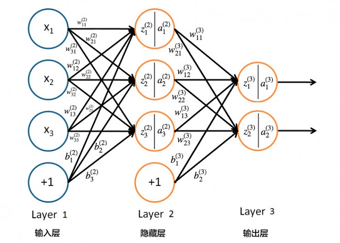

## 
反向传播算法

杨航锋

​	反向传播算法是目前用来训练人工神经网络（Artificial Neural Network，ANN）的最常用且最有效的算法，其主要思想是：将训练集数据输入到ANN的输入层，经过隐藏层，最后达到输出层并输出结果，这是ANN的前向传播过程；由于ANN的输出结果与实际结果有误差，则先计算估计值与实际值之间的误差，并将该误差从输出层向隐藏层反向传播，直至传播到输入层；在反向传播的过程中，根据误差调整各种参数的值；不断迭代上述过程，直至收敛。[更多文章见GitHub地址](https://github.com/yhangf/ML-NOTE)

#### 反向传播算法的推导

##### 符号约定

|            符号             |                             含义                             |
| :-------------------------: | :----------------------------------------------------------: |
|       $w_{jk}^{(l)}$        | 从$\ l-1\ $层的第$\ k\ $个神经元到第$\ l \ $层的第$\ j\ $个神经元之间的权重 |
|   $\boldsymbol{w^{(l)}}$    |              第$\ l-1\ $层到$\ l\ $层的权重矩阵              |
|         $b_j^{(l)}$         |             第$\ l\ $层的第$\ j\ $个神经元的偏置             |
|   $\boldsymbol{b^{(l)}}$    |                    第$\ l\ $层的偏置向量                     |
|         $z_j^{(l)}$         |             第$\ l\ $层第$\ j\ $个神经元的输入值             |
|   $\boldsymbol{z^{(l)}}$    |                    第$\ l\ $层的输入向量                     |
|         $a_j^{(l)}$         |             第$\ l\ $层第$\ j\ $个神经元的激活值             |
|   $\boldsymbol{a^{(l)}}$    |                  第$\ l\ $层的激活输出向量                   |
|          $N^{(l)}$          |                   第$\ l\ $层神经元的个数                    |
|      $C^{(i)}(\theta)$      |                第$\ i \ $个输出对应的损失函数                |
|         $C(\theta)$         |                           损失函数                           |
|      $\delta_j^{(l)}$       |        损失函数在第$\ l\ $层的第$\ j\ $个神经元的误差        |
| $\boldsymbol{\delta^{(l)}}$ |               损失函数在第$\ l\ $层的误差向量                |

综上有如下等式成立：
$$
\begin{aligned}
\begin{cases}
\begin{array}{lcl}
z_1^{(l)}&=&w_{11}^{(l)}a_1^{(l-1)}+w_{12}^{(l)}a_2^{(l-1)}+\cdots+w_{1N^{(l-1)}}^{(l)}a_{N^{(l-1)}}^{(l-1)}+b_1^{(l)}\\
z_2^{(l)}&=&w_{21}^{(l)}a_1^{(l-1)}+w_{22}^{(l)}a_2^{(l-1)}+\cdots+w_{2N^{(l-1)}}^{(l)}a_{N^{(l-1)}}^{(l-1)}+b_2^{(l)}\\
 &\vdots&\\
z_{N^{(l)}}^{(l)}&=&w_{N^{(l)}1}^{(l)}a_1^{(l-1)}+w_{N^{(l)}2}^{(l)}a_2^{(l-1)}+\cdots+w_{N^{(l)}N^{(l-1)}}^{(l)}a_{N^{(l-1)}}^{(l-1)}+b_{N^{(l)}}^{(l)}
\end{array}
\end{cases}
\end{aligned}
$$
写成矩阵乘法的形式
$$
\begin{aligned}
\begin{bmatrix}
z_1^{(l)} \\
z_2^{(l)}\\
\vdots\\
z_{N^{(l)}}^{(l)}
\end{bmatrix}
=
\begin{bmatrix}
w_{11}^{(l)} & w_{12}^{(l)} & \cdots & w_{1N^{(l-1)}}^{(l)}\\
w_{21}^{(l)} & w_{22}^{(l)} & \cdots & w_{2N^{(l-1)}}^{(l)}\\
\vdots & \vdots&\ddots&\vdots\\
w_{N^{(l)}1}^{(l)}&w_{N^{(l)}2}^{(l)}&\cdots&w_{N^{(l)}N^{(l-1)}}^{(l)}
\end{bmatrix}
\begin{bmatrix}
a_1^{(l-1)}\\
a_2^{(l-1)}\\
\vdots\\
a_{N^{(l-1)}}^{(l-1)}
\end{bmatrix}
+
\begin{bmatrix}
b_1^{(l)}\\
b_2^{(l)}\\
\vdots\\
b_{N^{(l)}}^{(l)}
\end{bmatrix}
\end{aligned}
$$
即
$$
\boldsymbol{z^{(l)}=w^{(l)}a^{(l-1)}+b^{(l)}}
$$
由于$\ \boldsymbol{a^{(l)}}=\sigma(\boldsymbol{z^{(l)}}) \ $，故有
$$
\boldsymbol{a^{(l)}}=\sigma(\boldsymbol{w^{(l)}a^{(l-1)}+b^{(l)}})
$$
其中$\ \sigma(x)\ $为激活函数，常见的比如取$\ \sigma(x)=\dfrac{1}{1+e^{-x}} \ $。

##### 神经网络的损失函数

​	根据神经网络模型每一层的$\ \boldsymbol{w^{(l)}}\ $和$ \ \boldsymbol{b^{(l)}} \ $可能互不相同，因此通过这样一个神经网络模型最后的输出为一个函数集合$\ f(x;\theta)\ $
$$
f(x;\theta)=\sigma(w^{(L)}\cdots\sigma(w^{(2)}\sigma(w^{(1)}x+b^{(1)})+b^{(2)})\cdots+b^{(L)})
$$
其中$\ L\ $表示神经网络的输出层，$\ \theta=\{w^{(1)},b^{(1)},w^{(2)},b^{(2)}\cdots, w^{(L)},b^{(L)}\}\ $	。假设训练数据集为($x^{(1)}$,$y^{(1)}$)，($x^{(2)}$,$y^{(2)}$)，$\cdots$，($x^{(r)}$,$y^{(r)}$)，$\cdots$，($x^{(m)}$,$y^{(m)}$)，其中$x^{(i)}\in\R^{n}$。接下来可以给出损失函数$\ C(\theta)\ $
$$
C^{(i)}(\theta)=\dfrac{1}{m}\sum\limits_{r=1}^{m}\Vert f(x^{(r)};\theta)-y^{(r)} \Vert\\
C(\theta)=\dfrac{1}{N^{(L)}}\sum\limits_{i=1}^{N^{(L)}}C^{(i)}(\theta)
$$
对于上述损失函数如果直接用梯度下降算法求解的话是不可行的。

##### 损失函数在输出层的误差

​	根据误差传播的传递性$\ \Delta z_j^{(L)} \rightarrow \Delta a_j^{(L)}\rightarrow\Delta C(\theta) \ $并结合链式求导法则可以求得损失函数在输出层神经元上的误差$\ \delta_j^{(L)}\ $。
$$
\begin{aligned}
\delta_j^{(L)}&=\dfrac{\partial C(\theta)}{\partial z_j^{(L)}}=\dfrac{\partial C(\theta)}{\partial a_j^{(L)}}\dfrac{\partial a_j^{(L)}}{\partial z_j^{(L)}}\\
&=\dfrac{\partial C(\theta)}{\partial a_j^{(L)}}\dfrac{\partial \sigma(z_j^{(L)})}{\partial z_j^{(L)}}\\
&=\dfrac{\partial C(\theta)}{\partial a_j^{(L)}}\sigma'(z_j^{(L)})
\end{aligned}
$$
对于输出层上的所有神经元，则可表示为向量形式 
$$
\begin{aligned}
\boldsymbol{\delta^{(L)}}
&=
\begin{bmatrix}
\delta_1^{(L)}\\
\delta_2^{(L)}\\
\vdots\\
\delta_{N^{(L)}}^{(L)}
\end{bmatrix}
=
\begin{bmatrix}
\dfrac{\partial C(\theta)}{\partial a_1^{(L)}}\sigma'(z_1^{(L)})\\
\dfrac{\partial C(\theta)}{\partial a_2^{(L)}}\sigma'(z_2^{(L)})\\
\vdots\\
\dfrac{\partial C(\theta)}{\partial a_{N^{L}}^{(L)}}\sigma'(z_{N^{L}}^{(L)})
\end{bmatrix}
=
\begin{bmatrix}
\dfrac{\partial C(\theta)}{\partial a_1^{(L)}}\\
\dfrac{\partial C(\theta)}{\partial a_2^{(L)}}\\
\vdots\\
\dfrac{\partial C(\theta)}{\partial a_{N^{L}}^{(L)}}
\end{bmatrix}
\odot
\begin{bmatrix}
\sigma'(z_1^{(L)})\\
\sigma'(z_2^{(L)})\\
\vdots\\
\sigma'(z_{N^{L}}^{(L)})
\end{bmatrix}\\
&=
\nabla_{\boldsymbol{a^{(L)}}}C(\theta)\odot\sigma'(\boldsymbol{z^{(L)}})
\end{aligned}
$$
其中$\ \odot\ ​$为Hadamard积，即两个矩阵对应元素的乘积 。

##### 损失函数在隐藏层的误差

​	因为上面已经求出了输出层的误差，根据误差反向传播的原理，当前层的误差可理解为上一层所有神经元误差的复合函数，即使用上一层的误差来表示当前层误差，并依次递推。 
$$
\begin{aligned}
\delta_j^{(l)}&=\dfrac{\partial C(\theta)}{\partial z_j^{(l)}}\ \ \ \ \ \ \ \ \ \ \ \ \ \ \ \ \ \ \ \ \ \ \ \ \ \ \ \ \ \ \ \ \ \ \ \ \ \ \ \ \ \ \ \ \ \ \ \ \ \ \ \ \ \ \ \ \ \ \ \ \ \ \ \ \ \ \ (1)\\
&=\sum\limits_{k=1}^{N^{(l+1)}} \dfrac{\partial C(\theta)}{\partial z_k^{(l+1)}}\dfrac{\partial z_k^{(l+1)}}{\partial a_j^{(l)}}\dfrac{\partial a_j^{(l)}}{\partial z_j^{(l)}}\ \ \ \ \ \  \ \ \ \ \ \ \ \ \ \ \ \ \ \ \ \ \ \ \ \ \ \ \ \ \ \ \ \ \ \ (2)\\
&=\sum\limits_{k=1}^{N^{(l+1)}} \delta_k^{(l+1)}\dfrac{\partial{\left(\sum\limits_{s=1}^{N^{(l)}}w_{ks}^{(l+1)}a_s^{(l)}+b_k^{(l+1)}\right)}}{\partial a_j^{(l)}}\dfrac{\partial a_j^{(l)}}{\partial z_j^{(l)}}\ \ \ \ \ \ \ \  (3)\\
&=\sum\limits_{k=1}^{N^{(l+1)}} \delta_k^{(l+1)}w_{kj}^{(l+1)}\sigma'(z_j^{(l)})\ \  \ \ \ \ \ \ \ \ \ \ \ \ \  \ \ \ \ \ \ \ \ \ \ \ \ \ \ \ \ \ \ \ \ \ \ \ \ \ (4)
\end{aligned}
$$
从$\ (1)\ $式到$\ (2)\ $式可理解为当前层的误差是由其后一层各个神经元的误差传播而来，即当前层神经元的误差是后一层各个神经元误差的复合函数，按照多元复合函数求导的链式法则可得$\ (2)\ $式；$\ (2)\ $式到$\ (3)\ $式首先利用了误差的定义其次根据$\ z_k^{(l+1)}\ $的定义对其进行展开；$\ (3)\ $式到$\ (4)\ $式较为简单直接利用了偏导数的求导法则。

​	同理对于隐藏层所有神经元的误差，可写成向量形式
$$
\begin{aligned}
\boldsymbol{\delta^{(l)}}
&=
\begin{bmatrix}
\delta_1^{(l)}\\
\delta_2^{(l)}\\
\vdots\\
\delta_{N^{(l)}}^{(l)}
\end{bmatrix}
=
\begin{bmatrix}
\sum\limits_{k=1}^{N^{(l+1)}} \delta_k^{(l+1)}w_{k1}^{(l+1)}\sigma'(z_1^{(l)})\\
\sum\limits_{k=1}^{N^{(l+1)}} \delta_k^{(l+1)}w_{k2}^{(l+1)}\sigma'(z_2^{(l)})\\
\vdots\\
\sum\limits_{k=1}^{N^{(l+1)}} \delta_k^{(l+1)}w_{kN^{(l)}}^{(l+1)}\sigma'(z_{N^{(l)}}^{(l)})
\end{bmatrix}
=
\begin{bmatrix}
\sum\limits_{k=1}^{N^{(l+1)}} \delta_k^{(l+1)}w_{k1}^{(l+1)}\\
\sum\limits_{k=1}^{N^{(l+1)}} \delta_k^{(l+1)}w_{k2}^{(l+1)}\\
\vdots\\
\sum\limits_{k=1}^{N^{(l+1)}} \delta_k^{(l+1)}w_{kN^{(l)}}^{(l+1)}
\end{bmatrix}
\odot
\begin{bmatrix}
\sigma'(z_1^{(l)})\\
\sigma'(z_2^{(l)})\\
\vdots\\
\sigma'(z_{N^{(l)}}^{(l)})
\end{bmatrix}\\
&=(\boldsymbol{w^{(l+1)})}^T\boldsymbol{\delta^{(l+1)}}\odot\sigma'(\boldsymbol{z^{(l)}})
\end{aligned}
$$

##### 损失函数对权重矩阵$\ w \ $的偏导数

​	根据误差传播的传递性$\ \Delta w_{jk}^{(l)}\rightarrow \Delta z_j^{(l)} \rightarrow \cdots\rightarrow\Delta C(\theta) \ $，因此损失函数可以看成是权重$\ w\ $的复合函数，由链式求导法则可知
$$
\begin{aligned}
\dfrac{\partial C(\theta)}{\partial w_{jk}^{(l)}} &= \dfrac{\partial C(\theta)}{\partial z_{j}^{(l)}}\dfrac{\partial z_{j}^{(l)}}{\partial w_{jk}^{(l)}}\\
&=
\delta_j^{(l)}\dfrac{\partial\left(\sum\limits_{s=1}^{N^{(l-1)}} w_{js}^{(l)}a_s^{(l-1)}+b_s^{(l)} \right)}{\partial w_{jk}^{(l)}}\\
&=
\delta_j^{(l)}a_k^{(l-1)}

\end{aligned}
$$
这个公式表明损失函数$\ C(\theta)\  $对权重$\ w_{jk}^{(l)}\ $的梯度其实就等于第的梯度其实就等于第$\ l\  $层第层第$\ j\  $个神经元的误差乘以个神经元的误差乘以$\ l-1\  $层第层第$\ k\  $个神经元的输出，可以发现当激活函数的输出值个神经元的输出，可以发现当激活函数的输出值$\ a\  $很小的时候那么相应的梯度也会变得非常小，因此依赖于梯度下降算法来更新权重很小的时候那么相应的梯度也会变得非常小，因此依赖于梯度下降算法来更新权重$\ w_{jk}\ $将会变得非常缓慢，换句话说就是**当某个权重$\ w_{jk}\ $连接的上一个激活函数输出值连接的上一个激活函数输出值$\ a\  $很小的话，那么这个权重很小的话，那么这个权重$\ w_{jk}\ $的学习将会很慢。** 

#####  损失函数对偏置$\ b \ $的偏导数

​	同理根据误差传播的传递性$\ \Delta b_j^{(l)}\rightarrow \Delta z_j^{(l)} \rightarrow \cdots\rightarrow\Delta C(\theta) \  $，因此损失函数也可以看成是偏置$\ b\ $的复合函数，由链式求导法则可知
$$
\begin{aligned}
\dfrac{\partial C(\theta)}{\partial b_j^{(l)}}&=\dfrac{\partial C(\theta)}{\partial z_j^{(l)}}\dfrac{\partial z_j^{(l)}}{\partial b_j^{(l)}}\\
&=\delta_j^{(l)}\cdot1
\\
&=\delta_j^{(l)}
\end{aligned}
$$
由这个公式可知，损失函数$\ C(\theta)\ $对于偏置$\ b_j^{(l)}\ $的偏导数会等于损失函数$\ C(\theta)\ $在这个神经元上面的误差。如果要求梯度的话就需要求出这些偏导数，但现在通过误差却间接得到了偏导数。 

#### 反向传播算法流程总结

##### (step1)   训练数据输入

​	假设训练数据集为($x^{(1)}$,$y^{(1)}$)，($x^{(2)}$,$y^{(2)}$)，$\cdots$，($x^{(r)}$,$y^{(r)}$)，$\cdots$，($x^{(m)}$,$y^{(m)}$)，其中$x^{(i)}\in\R^{n}$，并为输入层选择合适的激活函数$\ \sigma(x)\ $。

##### (step2)   前向传播过程

​	对于神经网络的各层前向的计算一遍结果，$\ l=2,3,\cdots,L\  ​$。
$$
\begin{aligned}
\begin{cases}
\boldsymbol{z^{(l)}=w^{(l)}a^{(l-1)}+b}\\
\boldsymbol{a^{(l)}}=\sigma(\boldsymbol{z^{(l)}})

\end{cases}
\end{aligned}
$$

##### (step3)   计算输出层误差

$$
\boldsymbol{\delta^{(L)}}=\nabla_{\boldsymbol{a^{(L)}}}\boldsymbol{C(\theta)}\odot\boldsymbol{\sigma'(z^{(L)})}
$$

##### (step4)   计算反向传播误差

​	对于神经网络的各层从后向前计算一遍结果，$\ l=L-1,L-2,\cdots,2\ $。
$$
\boldsymbol{\delta^{(l)}}=\left((\boldsymbol{w^{(l+1)}})^T\boldsymbol{\delta^{(l+1)}}\right)\odot\sigma'(\boldsymbol{z^{(l)}})
$$

##### (step5)   计算并且更新权重$\ w\ $和偏置$\ b\ $

​	通过梯度下降算法更新权重$\ w\  $和偏置$\ b\  $的值，$\ \alpha\ $为学习率其中$\ \alpha\in(0,1]\ $。
$$
\begin{aligned}
\begin{cases}
w_{jk}^{(l)}:=w_{jk}^{(l)}-\alpha\dfrac{\partial C(\theta)}{\partial w_{jk}^{(l)}}\\
b_j^{(l)}:=b_j^{(l)}-\alpha\dfrac{\partial C(\theta)}{\partial b_j^{(l)}}
\end{cases}
\end{aligned}
$$
即
$$
\begin{aligned}
\begin{cases}
w_{jk}^{(l)}:=w_{jk}^{(l)}-\alpha a_k^{(l-1)}\delta_j^{(l)}\\
b_j^{(l)}:=b_j^{(l)}-\alpha\delta_j^{(l)}
\end{cases}
\end{aligned}
$$

