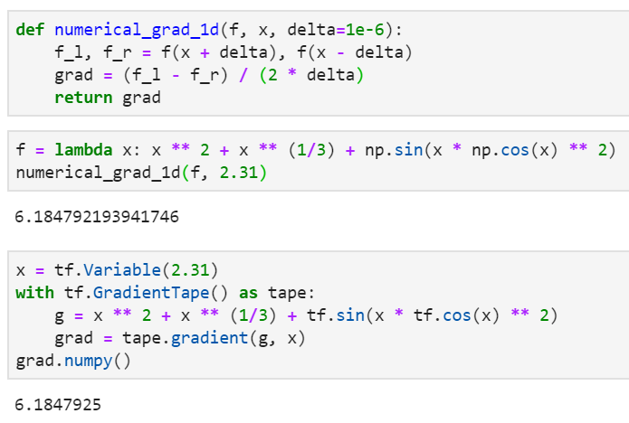
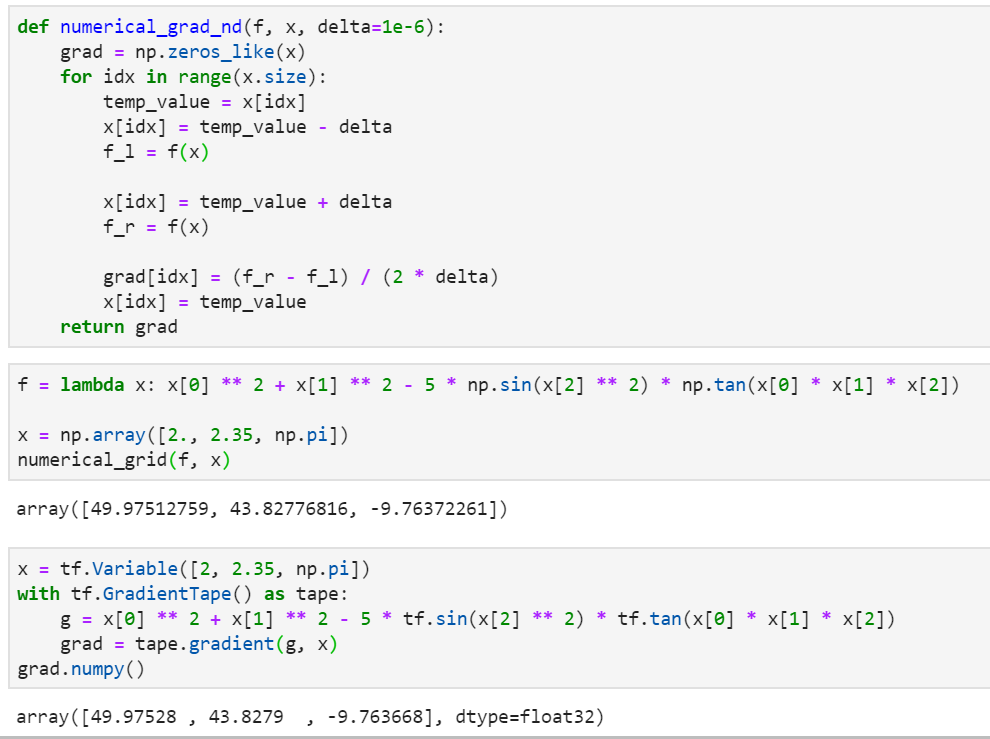

# <center>数值微分理论和简单代码实现</center>

<center><strong>杨航锋</strong></center>

数值微分是数值方法中的名词，它可以根据函数在一些离散点的函数值，从而推算出它在某点的导数的近似值。在平常写代码的过程中，经常会调用某些优化算法比如随机梯度下降算法等，因为$TensorFlow$、$PyTorch$等深度学习算法库都已经封装好了相关算法，直接调用$API$即可得到相应结果，所以很自然的会忽略梯度的底层实现。带着这个疑惑我查阅了很多文献资料，阅读下来发现这些算法库自动计算梯度的理论还蛮复杂的，但是实现一个简单的数值微分算法还是挺简单的，具备中学数学知识即可！

#### 1  一元函数的数值微分

可以根据函数在某点处导数的定义来实现代码，首先回顾一下函数在一点处导数的相关定义

> **定义**    设函数$\ y=f(x)\ $在点$\ x_0\ $的某个邻域内有定义，当自变量$\ x\ $在$\ x_0\ $处取得增量$\ \Delta x\ $($x_0+\Delta x$仍在该邻域内)时，相应地，因变量取得增量$\ \Delta y=f(x_0+\Delta x)-f(x_0)\ $；如果$\ \Delta y\ $与$\ \Delta x\ $之比当$\ \Delta x\to 0\ $时极限存在，那么称函数$\ y=f(x)\ $在点$\ x_0\ $处可导，并称这个极限为函数$\ y=f(x)\ $在点$\ x_0\ $处地导数，记为$\ f'(x_0)\ $，即
> $$
> f'(x_0)=\lim\limits_{\Delta x\to 0}\dfrac{\Delta y}{\Delta x}=\lim\limits_{\Delta x\to 0}\dfrac{f(x_0+\Delta x)-f(x_0)}{\Delta x}
> $$
> 也可记作$\ y'\Big |_{x=x_0},\dfrac{\mathbb{d}y}{\mathbb{d}x}\Bigg |_{x=x_0} \ $或$\ \dfrac{\mathbb{d}f(x)}{\mathbb{d}x}\Bigg |_{x=x_0}\ $。

由于计算机计算数值微分会带来误差，故对原始定义做一个调整
$$
f'(x_0)=\lim\limits_{\Delta x\to 0}\dfrac{f(x_0+\Delta x)-f(x_0-\Delta x)}{2\Delta x}
$$
使用调整后的导数定义求解数值微分要比单边近似地精度要高，有了理论基础就可以使用代码实现

```python
def numerical_grad_1d(f, x, delta=1e-6):
    f_l, f_r = f(x + delta), f(x - delta)
    grad = (f_l - f_r) / (2 * delta)
    return grad
```

例如使用上述代码计算函数$\ f(x)=x^2+x^{\frac{1}{3}}+\sin(x \cos^2(x)) \ $在$\ x=2.31\ $处地导数值

```python
import numpy as np

f = lambda x: x ** 2 + x ** (1/3) + np.sin(x * np.cos(x) ** 2)
numerical_grad_1d(f, 2.31)
```

通过$TensorFlow$自动微分可以验证计算地准确性

```python
import tensorflow as tf # tensorflow2.0

x = tf.Variable(2.31)
with tf.GradientTape() as tape:
    g = x ** 2 + x ** (1/3) + tf.sin(x * tf.cos(x) ** 2)
    grad = tape.gradient(g, x)
grad.numpy()
```

两者计算结果对比



#### 2  多元函数的数值微分

同理可以根据多元函数偏导数的定义来实现代码，多元函数在某一点处偏导数的定义如下

> **定义**    设函数$\ z=f(x,y)\ $在点$\ (x_0,y_0)\ $的某一邻域内有定义，若$\ \lim\limits_{\Delta x\to 0}\frac{f(x_0+\Delta x,y_0)-f(x_0,y_0)}{\Delta x}\ $存在，则称此极限为$\ z=f(x,y)\ $函数在点$\ (x_0, y_0)\ $处对$\ x \ $的偏导数，记作$\ \frac{\partial z}{\partial x}\Bigg |_{(x_0,y_0)}, \frac{\partial f}{\partial x}\Bigg |_{(x_0,y_0)},z_x(x_0,y_0),f'_x(x_0,y_0)\ $。即
> $$
> \frac{\partial z}{\partial x}\Bigg |_{(x_0,y_0)}=\lim\limits_{\Delta x\to 0}\frac{f(x_0+\Delta x,y_0)-f(x_0,y_0)}{\Delta x}
> $$
> 同样的，若$\ \lim\limits_{\Delta y\to 0}\frac{f(x_0,y_0+\Delta y)-f(x_0,y_0)}{\Delta y}\ $存在，则称此极限为$\ z=f(x,y)\ $函数在点$\ (x_0, y_0)\ $处对$\ y \ $的偏导数，记作$\ \frac{\partial z}{\partial y}\Bigg |_{(x_0,y_0)}, \frac{\partial f}{\partial y}\Bigg |_{(x_0,y_0)},z_y(x_0,y_0),f'_y(x_0,y_0)\ $。即
> $$
> \frac{\partial z}{\partial y}\Bigg |_{(x_0,y_0)}=\lim\limits_{\Delta y\to 0}\frac{f(x_0,y_0+\Delta y)-f(x_0,y_0)}{\Delta y}
> $$
> 

为了减小单边计算误差，对原始定义也做一些微调
$$
\frac{\partial z}{\partial x}\Bigg |_{(x_0,y_0)}=\lim\limits_{\Delta x\to 0}\frac{f(x_0+\Delta x,y_0)-f(x_0-\Delta x,y_0)}{2\Delta x}\\
\frac{\partial z}{\partial y}\Bigg |_{(x_0,y_0)}=\lim\limits_{\Delta y\to 0}\frac{f(x_0,y_0+\Delta y)-f(x_0,y_0-\Delta y)}{2\Delta y}
$$
多元函数的数值微分代码实现

```python
def numerical_grad_nd(f, x, delta=1e-6):
    grad = np.zeros_like(x)
    for idx in range(x.size):
        temp_value = x[idx]
        x[idx] = temp_value - delta
        f_l = f(x)
        
        x[idx] = temp_value + delta
        f_r = f(x)
        
        grad[idx] = (f_r - f_l) / (2 * delta)
        x[idx] = temp_value
    return grad
```

例如使用上述代码计算多元函数$\ f(x,y,z)=x^2+y^2-5\sin(z^2)\tan(xyz)\ $在点$\ (2, 2.35, \pi)\ $处的梯度值

```python
f = lambda x: x[0] ** 2 + x[1] ** 2 - 5 * np.sin(x[2] ** 2) * np.tan(x[0] * x[1] * x[2])
x = np.array([2., 2.35, np.pi])
numerical_grid(f, x)
```

通过$TensorFlow$自动微分可以验证计算地准确性

```python
x = tf.Variable([2, 2.35, np.pi])
with tf.GradientTape() as tape:
    g = x[0] ** 2 + x[1] ** 2 - 5 * tf.sin(x[2] ** 2) * tf.tan(x[0] * x[1] * x[2])
    grad = tape.gradient(g, x)
grad.numpy()
```

两者计算结果对比



