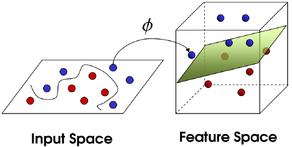

## 
核函数粗浅的理解

杨航锋

#### 核函数的定义

​	设$\ \mathbb{X} \ $是$\ \mathbb{R}^n\ $中的一个子集，称定义在$\ \mathbb{X}\times\mathbb{X} \ $上的函数$\ k(x,y)\ $是核函数，如果存在一个从$\ \mathbb{X}\ $到希尔伯特空间(特征空间)$\ \mathbb{H}\ $的映射$\ \phi\ $
$$
\phi : \xi\mapsto\phi(\xi)\in\mathbb{H}
$$
使得对任意的$\ x,y\in\mathbb{X}\ $,  
$$
k(x,y)=(\phi(x),\phi(y))=\phi(x)^T\phi(y)
$$
都成立。

#### 具体例子

​	假设$\ A=(1, 2)^T、B=(3,4)^T\ $，构造一个映射$\ \phi(\cdot)=(x_1^2,\sqrt{2}x_1x_2,x_2^2)^T\ $，则可知
$$
\begin{aligned}
&\phi(A)=(1,2\sqrt{2},4)^T\\
&\phi(B)=(9,12\sqrt{2},16)^T
\end{aligned}
$$
因此通过映射$\ \phi(\cdot)\ $将点$\ A、B\ $从二维平面升维到三维空间。然后计算
$$
\begin{aligned}
\phi(A)^T\phi(B)&=1\times9+2\sqrt{2}\times12\sqrt{2}+4\times16\\
&=9+48+64\\
&=121
\end{aligned}
$$
上述运算是在映射后的高维空间下做内积，那么是否能直接在原始的空间中进行相应的运算，使得低维情况下的运算结果等于高维情况下的运算结果呢？答案是肯定的可以通过核函数$\ k(x,y)=(x^Ty)^2\ $来实现
$$
\begin{aligned}
k(A,B)&=(A^TB)^2\\
&=(1\times3+2\times4)^2\\
&=121
\end{aligned}
$$
是不是很神奇，低维空间和高维空间居然通过核函数巧妙的联通起来了，这样做最大的优点是避免了维度灾难，也就是说高维空间中的运算计算量很大呈指数级别复杂度，难以解决；低维空间中的运算计算量很小但是两者的最终结果是一致的。例如上述计算过程，高维空间中执行了9次乘法运算和2次加法运算，低维空间中仅执行了3次乘法运算和1次加法运算，要知道这才二维空间映射到三维空间如果映射到$\ n\ $维空间呢？

#### 小结

​	**核函数是二元函数，输入是映射之前的两个向量，其输出等价于两个向量映射之后的内积。**对于$\ \phi(\cdot)\ $你并不需要知道具体对应哪种映射，表达式是什么，你需要知道的是核函数肯定对应于某一种映射$\ \phi(\cdot)\ $即可。